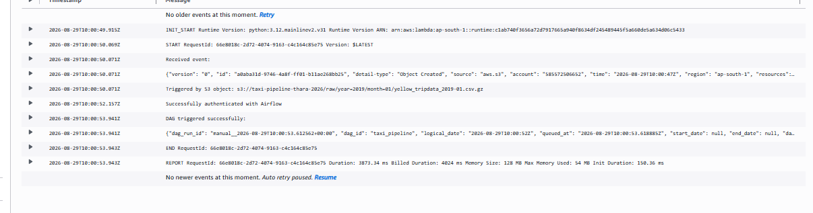
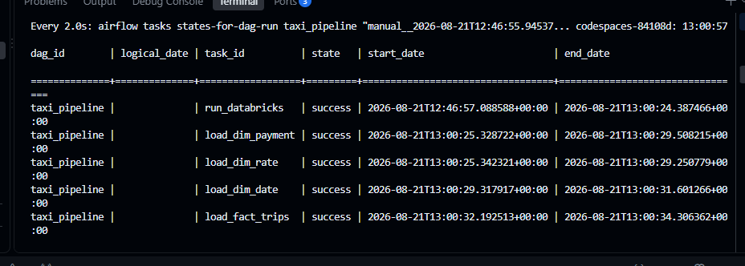
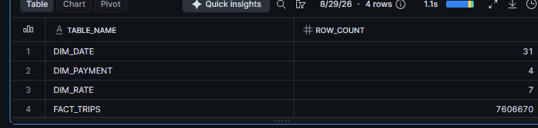

# 🚕 Event-Driven NYC Taxi Data Pipeline

An end-to-end event-driven data engineering pipeline that processes NYC Taxi trip data using Databricks, Apache Airflow, AWS, and Snowflake.

## 📌 Project Overview

This project demonstrates an automated cloud-based data pipeline.

When a new file is uploaded to the `raw/` folder in Amazon S3:

1. Amazon EventBridge detects the S3 Object Created event.
2. EventBridge invokes an AWS Lambda function.
3. Lambda authenticates with Apache Airflow and triggers the `taxi_pipeline` DAG.
4. Airflow orchestrates the Databricks ETL workflow.
5. Transformed data is loaded into Snowflake.

## 🏗️ Architecture

```text
NYC Taxi Data
      │
      ▼
Amazon S3 (Raw Zone)
      │
      │ Object Created Event
      ▼
Amazon EventBridge
      │
      ▼
AWS Lambda
      │
      │ Trigger DAG
      ▼
Apache Airflow
      │
      ▼
Databricks (PySpark ETL)
      │
      ▼
Amazon S3 (Staging)
      │
      ▼
Snowflake
```

## ⚙️ Technologies Used

- Amazon S3
- Amazon EventBridge
- AWS Lambda
- Apache Airflow
- Astro CLI
- GitHub Codespaces
- Databricks
- PySpark
- Snowflake
- Python
- Git & GitHub

## 🔄 Pipeline Workflow

### 1. Raw Data Ingestion

NYC Taxi trip data is stored in the Amazon S3 raw zone:

```text
s3://taxi-pipeline-thara-2026/raw/
```

### 2. Event Detection

Amazon EventBridge listens for S3 `Object Created` events where the object key begins with:

```text
raw/
```

### 3. AWS Lambda

The Lambda function:

- Receives the S3 event
- Extracts the bucket name and object key
- Authenticates with Apache Airflow
- Triggers the `taxi_pipeline` DAG
- Passes the uploaded file information to the DAG

**Successful Lambda Trigger**



### 4. Apache Airflow Orchestration

The `taxi_pipeline` DAG orchestrates:

1. Databricks ETL processing
2. Loading dimension tables into Snowflake
3. Loading the fact table into Snowflake

**Successful Airflow Pipeline Execution**



### 5. Databricks Transformation

Databricks processes the NYC Taxi data using PySpark and generates:

- `dim_payment`
- `dim_rate`
- `dim_date`
- `fact_trips`

The transformed data is stored in the S3 staging layer.

### 6. Snowflake Data Warehouse

The transformed dimension and fact tables are loaded into Snowflake for analytics.

**Snowflake Data Verification**



## 📊 Data Model

### Dimension Tables

| Table | Description |
|---|---|
| `DIM_PAYMENT` | Payment type information |
| `DIM_RATE` | Rate code information |
| `DIM_DATE` | Date-related attributes |

### Fact Table

| Table | Description |
|---|---|
| `FACT_TRIPS` | NYC Taxi trip data |

## 📁 Project Structure

```text
.
├── dags/
│   └── taxi_pipeline.py
├── Dockerfile
├── requirements.txt
├── packages.txt
└── README.md
```

## 🚀 Event-Driven Flow

```text
New File Uploaded to S3
          │
          ▼
    EventBridge
          │
          ▼
      AWS Lambda
          │
          ▼
   Airflow DAG Trigger
          │
          ▼
   Databricks PySpark ETL
          │
          ▼
      S3 Staging
          │
          ▼
       Snowflake
```

## 🎯 Key Concepts Demonstrated

- Event-driven architecture
- Cloud-based ETL pipelines
- Workflow orchestration
- Serverless computing
- Distributed data processing
- Data lake architecture
- Star schema modeling
- Cloud data warehousing
- Cross-platform integration

## 🔮 Future Enhancements

- Implement Infrastructure as Code (IaC) using Terraform to provision and manage AWS resources such as S3, EventBridge, Lambda, and IAM roles.
- Make the pipeline dynamically process the specific file uploaded to the S3 raw zone.
- Add automated data quality checks.
- Implement monitoring and alerting for pipeline failures.
- Add CI/CD for automated DAG deployment.

## 👩‍💻 Author

**Thara Mathew**

Data Engineer
